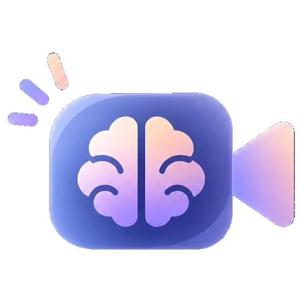
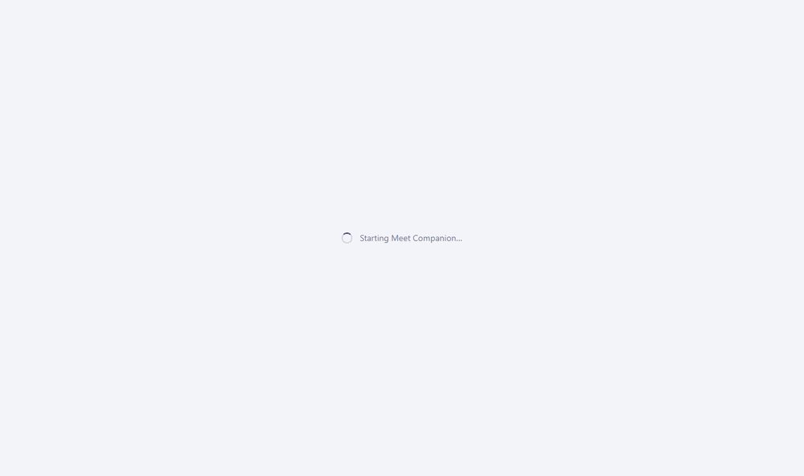
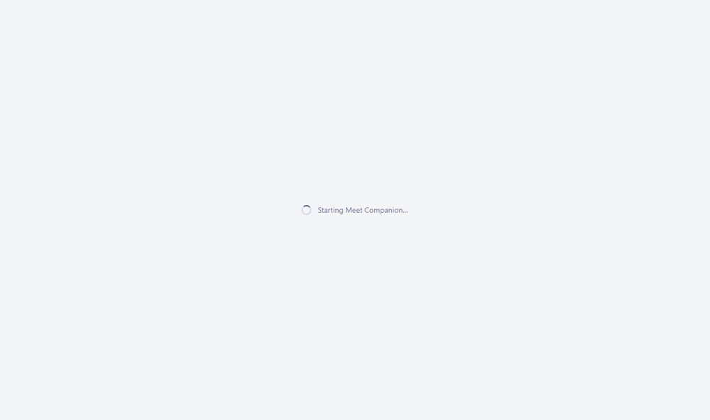
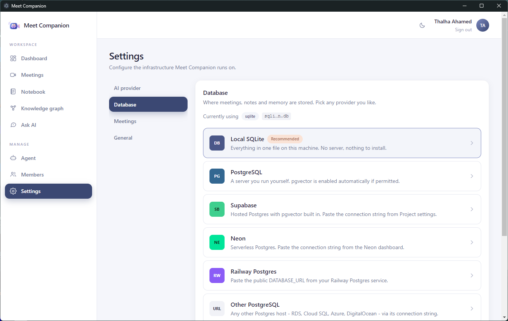
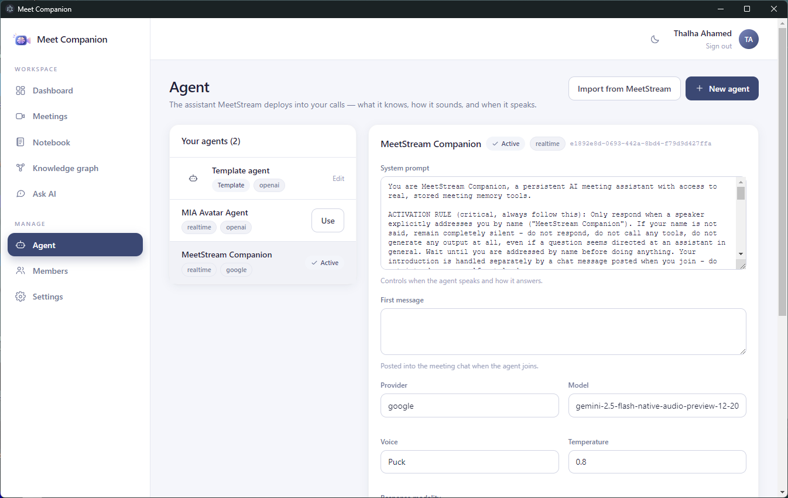

<div align="center">



# Meet Companion

**A bot joins your call. What was said comes back as decisions, action items and searchable notes — on your machine, with the AI model and database you choose.**

[](https://github.com/ThalhaAhamed/MeetCompanion/releases/latest)
[](https://github.com/ThalhaAhamed/MeetCompanion/actions)

[](LICENSE)

[Quick start](#-quick-start) · [Install](#-installation) · [Features](#-features) · [See it work](#-see-it-work) · [Configuration](#%EF%B8%8F-configuration) · [FAQ](#-faq) · [Docs](#-documentation)

</div>

<div align="center">

</div>

No SaaS, no per-seat pricing, no vendor lock-in. Meetings become **Markdown notes with live action-item checkboxes**, searchable **semantically**, answerable with **Ask AI** — and the in-call agent can recall "what did we decide last time?" *during* the next meeting.

## 🚀 Quick start

**Desktop app** (Windows, macOS, Linux) — download, open, done:

**[⬇ Download the latest release](https://github.com/ThalhaAhamed/MeetCompanion/releases/latest)**

The first run walks you through five steps — workspace, account, storage, AI model, review — and you are in. Local SQLite and a local Ollama model need no keys at all.

**Self-hosting instead?**

```bash
docker compose up -d      # → http://localhost:8000
```

## 📥 Installation

| Platform | Get it | First launch |
|---|---|---|
| **Windows** | [`MeetCompanion-Windows-Setup.exe`](https://github.com/ThalhaAhamed/MeetCompanion/releases/latest) | SmartScreen: **More info → Run anyway** (unsigned build) |
| **macOS** | [`…-macOS-arm64.dmg`](https://github.com/ThalhaAhamed/MeetCompanion/releases/latest) (Apple silicon) · [`…-x64.dmg`](https://github.com/ThalhaAhamed/MeetCompanion/releases/latest) (Intel) | Drag to Applications, then **right-click → Open** once |
| **Linux** | [`…-Linux-x86_64.AppImage`](https://github.com/ThalhaAhamed/MeetCompanion/releases/latest) | `chmod +x`, run |
| **Docker** | `docker compose up -d` | Open <http://localhost:8000> |
| **From source** | Python 3.12 + Node 22 — [docs/development.md](docs/development.md) | `python scripts/dev.py` |

> [!TIP]
> No `.env`, no database setup, no migrations to run: the first launch configures everything and the app creates and upgrades its own schema. Where your data lives, per OS: [docs/installation.md](docs/installation.md).

## 💡 Why Meet Companion?

- **Bring your own AI.** OpenAI, Anthropic, Gemini, Groq, xAI (Grok), a local [Ollama](https://ollama.com) model, or any OpenAI-compatible endpoint. Switch in Settings at any time.
- **Your data stays where you put it.** A local SQLite file by default; PostgreSQL, Supabase, Neon, Railway or any Postgres host when you want it. Embeddings are computed locally and never leave the machine.
- **Meetings become notes, not a feed.** Each processed meeting is filed as a Markdown note under `Meetings / year / month`, with live action-item checkboxes — a notebook you would have organised that way yourself.
- **Fully offline is a real option.** With Ollama and SQLite, no data leaves your computer and no API key is needed — the only outbound call is to [MeetStream](https://meetstream.ai) when you actually send a bot into a call.

## ✨ Features

- 🎥 **Meeting capture** — send a bot into Google Meet, Zoom or Teams, paste a transcript from anywhere, or import bots that already ran on your MeetStream account.
- 🧠 **Memory extraction** — transcripts become decisions, commitments, requirements, concerns, open questions and action items with owners and due dates.
- 📓 **Notebook** — nested folders, tags, favourites, search and sort; rendered Markdown with an editor behind it.
- ✅ **Action items that stay in sync** — tick a box in a note and the task completes on the dashboard; write `- [ ] call Bob` in any note and it becomes a real action item.
- 🔍 **Semantic search** — hybrid vector + keyword search across everything ever said.
- 💬 **Ask AI** — answers grounded in your notes, meetings and uploaded documents (PDF, Word, Markdown, text, CSV), with sources, and instructed never to invent.
- 🕸️ **Knowledge graph** — meetings, people, decisions and action items as an explorable graph with filters and force controls.
- 🎙️ **In-call recall** — a built-in [MCP](https://modelcontextprotocol.io) server lets the in-meeting agent answer from your memory while the call is happening.
- 👥 **Workspaces** — share one with a join code; owners decide what members may add, edit, delete, export or invite.
- 🔌 **Provider-agnostic** — LLMs and databases are adapters behind an interface; adding one is a single file.

## 🎯 See it work

### 💬 Ask AI

Ask in plain language; the answer is grounded in your notes, meetings and documents, every source one click away. If the notes do not say, it says so.

<div align="center">

</div>

### 🕸️ Knowledge graph

Every meeting, person, memory and action item is a node; the edges are who said what where. Click a node and the rest fades back; filter by type, hide orphans, tune the forces.

<div align="center">

</div>

### 👥 Workspaces and permissions

Hand someone the join code and the workspace is shared. Owners decide what members may do, from the same page. One account can belong to several workspaces and switch from the top bar.

<div align="center">

</div>

### 🗄️ Pick any database

Local SQLite out of the box, or PostgreSQL, Supabase, Neon, Railway or any Postgres host. Test the connection, save, and the app switches over live — no restart.

<div align="center">

</div>

### 🤖 Your agent, your template

A template agent holds the starting system prompt, first message, provider, model and voice. New agents are created from it.

<div align="center">

</div>

### ⚡ First run

<div align="center">

</div>

## 🏗️ How it works

[MeetStream](https://meetstream.ai) provides the bot that joins Google Meet, Zoom and Teams and produces the transcript. **Everything after that — extraction, memory, notes, search, the in-call agent's recall — runs in this project, on infrastructure you own.** The desktop app and the self-hosted web app are the same code.

```
                    UI  (React + Vite + Tailwind)
                     │
                    API  (FastAPI)
                     │
        Services / domain logic
                     │
            Provider abstractions
        ┌────────────┼─────────────┐
       LLM        Database      MeetStream
        │             │
  OpenAI            pgvector  (PostgreSQL)
  Anthropic         in-process cosine  (SQLite)
  Gemini
  Ollama
  Groq
  xAI (Grok)
  OpenAI-compatible
```

**Providers are interfaces, not conditionals.** Adding an LLM vendor is one adapter in `app/providers/llm/` plus a registry entry; the adapter's declared fields *are* the settings form. **The database is swapped, not abstracted away** — only similarity and keyword search differ between databases, and those live in `app/providers/database/`. The full picture: [docs/architecture.md](docs/architecture.md).

## ⚙️ Configuration

Everything is set from **Settings** in the app and saved to `data/config.json`. An **environment variable that is set always wins** over the saved value, so containers stay reproducible — the UI shows those fields as read-only.

| Variable | Default | Purpose |
|---|---|---|
| `LLM_PROVIDER` / `LLM_MODEL` / `LLM_API_KEY` | from Settings | Which AI runs extraction and Ask AI |
| `DATABASE_URL` | local SQLite | `postgresql://…` for a shared or hosted database |
| `MEETSTREAM_API_KEY` | per member, in Settings | Lets the app send bots into calls |
| `MCP_SERVER_URL` | — | The public URL MeetStream reaches your server on |
| `ALLOW_SELF_SIGNUP` | `true` | `false` on a public server: only owners add members |

The full list, precedence rules and Docker notes: [docs/configuration.md](docs/configuration.md).

## 🧰 Technology stack

**Backend** Python 3.12 · FastAPI · SQLAlchemy 2 (async) · Alembic · SQLite / PostgreSQL + pgvector **·** **AI** adapters over `httpx` for OpenAI, Anthropic, Gemini, Groq, xAI, Ollama and OpenAI-compatible endpoints; local embeddings with `all-MiniLM-L6-v2` on ONNX **·** **Frontend** React 19 · Vite · Tailwind CSS 4 **·** **Desktop** Electron around a PyInstaller-frozen server **·** **Integration** MeetStream bots, HMAC-signed webhooks, a built-in MCP server **·** **Quality** 246 backend + 15 frontend tests, CI on SQLite and Postgres, Docker build on every push.

Why each was chosen: [docs/development.md#tech-stack](docs/development.md#tech-stack).

## ❓ FAQ

**Does my data leave my machine?**
Only where you point it. With SQLite and Ollama, nothing leaves. A hosted Postgres or a cloud LLM sees exactly what you would expect them to; embeddings are always computed locally. Details: [docs/security.md](docs/security.md).

**Do I need MeetStream?**
Only to send a bot into a call. Pasting a transcript, uploading documents, search and Ask AI all work without it.

**Which meeting platforms?**
Google Meet, Zoom and Microsoft Teams, via MeetStream bots.

**Which AI models?**
OpenAI, Anthropic, Google Gemini, Groq, xAI (Grok), Ollama (local), and any OpenAI-compatible endpoint. *Test connection* checks the key **and** that the model exists.

**Which databases?**
SQLite (default, zero setup), PostgreSQL with pgvector — Supabase, Neon, Railway or your own server. Switching is live, no restart.

**Can my team share one workspace?**
Yes: one shared Postgres, a join code from the Members page, and owner-controlled permissions. [docs/workspaces.md](docs/workspaces.md).

**Why does the in-call agent need my server to be reachable?**
MeetStream calls your server for memory lookups and webhooks. A tunnel or a public host works; see [docs/live-meetings.md](docs/live-meetings.md).

**Is it free?**
MIT-licensed, no accounts, no telemetry. You pay only whichever AI or database provider you choose to use — or nothing, with Ollama and SQLite.

## 📚 Documentation

| | |
|---|---|
| [Installation](docs/installation.md) | Per-OS installer notes, first launch, where data lives |
| [Configuration](docs/configuration.md) | Every setting and environment variable; Docker |
| [Live meetings](docs/live-meetings.md) | Making your server reachable by MeetStream (tunnels, hosting) |
| [Workspaces and export](docs/workspaces.md) | Sharing, roles, permissions, Markdown/JSON export |
| [Security and privacy](docs/security.md) | What is stored where, the security model, how sign-in works |
| [Troubleshooting](docs/troubleshooting.md) | Stuck at *Extracting…*, provider errors, ports, databases |
| [For developers](docs/development.md) | Run from source, tests, building the desktop app, tech stack |
| [Architecture](docs/architecture.md) | Layers, provider contracts, retrieval, tenancy |
| [Contributing](CONTRIBUTING.md) · [Agent guide](AGENTS.md) · [Security policy](SECURITY.md) | |

## 🤝 Contributing

Issues, pull requests, providers and docs are all welcome — start with [CONTRIBUTING.md](CONTRIBUTING.md). A new LLM provider is one file in `app/providers/llm/` (`ollama.py` is the smallest example). Run the tests before opening a pull request; commits follow [Conventional Commits](https://www.conventionalcommits.org/).

**Roadmap:** code-signed Windows and macOS builds · MySQL / MariaDB · re-indexing after changing embedding models · desktop auto-update.

## 📄 License

[MIT](LICENSE) — use it, change it, ship it. Attribution appreciated.

Built on [MeetStream](https://meetstream.ai) for meeting bots, [`all-MiniLM-L6-v2`](https://huggingface.co/sentence-transformers/all-MiniLM-L6-v2) via [fastembed](https://github.com/qdrant/fastembed) for local embeddings, and FastAPI, SQLAlchemy, React, Vite, Tailwind and Electron.
