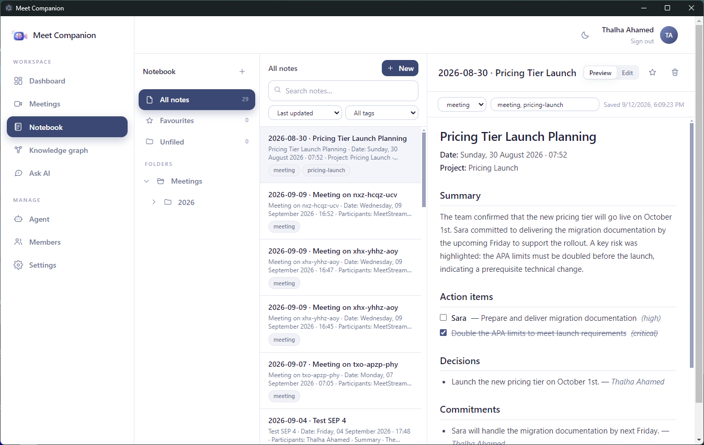
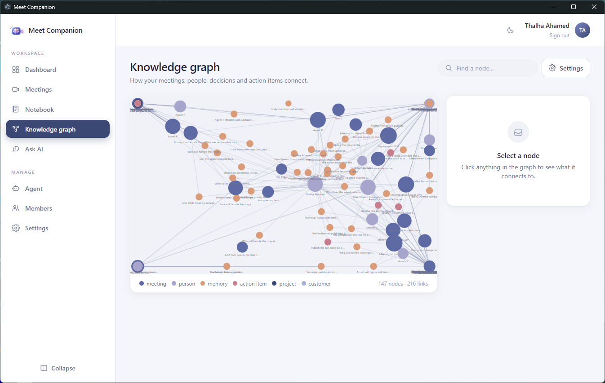

<div align="center">


# Meet Companion

### Make meeting data smarter.

[](https://github.com/ThalhaAhamed/MeetCompanion/releases/latest)
[](https://github.com/ThalhaAhamed/MeetCompanion/releases)
[](https://github.com/ThalhaAhamed/MeetCompanion/stargazers)
[](https://github.com/ThalhaAhamed/MeetCompanion/actions)
[](LICENSE)


**Open Source • Bring Your Own AI • Runs On Your Machine**

[Download](#-installation) · [Features](#-features) · [How it works](#%EF%B8%8F-how-it-works) · [Build from source](#%EF%B8%8F-for-developers) · [MeetStream](https://meetstream.ai)

</div>

An AI assistant joins your meetings, and afterwards everything that was said
becomes something you can actually use: decisions, commitments and action items
that are filed into a notebook, searchable semantically, and answerable with
Ask AI — all with a model, database and machine that you choose.

<div align="center">

</div>

<details>
<summary><b>Table of contents</b></summary>

- [Introduction](#-introduction)
- [Why Meet Companion?](#-why-meet-companion)
- [Features](#-features)
- [Installation](#-installation)
- [Features in action](#-features-in-action)
- [How it works](#%EF%B8%8F-how-it-works)
- [Configuration](#%EF%B8%8F-configuration)
- [Docker](#-docker)
- [Live meetings: reaching your server](#-live-meetings-reaching-your-server)
- [Privacy and data](#-privacy-and-data)
- [Security model](#-security-model)
- [For developers](#%EF%B8%8F-for-developers)
- [Contributing](#-contributing)
- [Roadmap](#%EF%B8%8F-roadmap)
- [License](#-license)

</details>

## 📖 Introduction

Meet Companion is built on top of [MeetStream](https://meetstream.ai), which
provides the bot that joins Google Meet, Zoom and Teams calls and produces the
transcript. Everything after that point — extraction, memory, notes, search,
the in-call agent's recall — runs in this project, on infrastructure you own.

It ships as a desktop app for Windows, macOS and Linux, and as a self-hostable
web app. Both are the same code.

## 💡 Why Meet Companion?

- **Nothing is hard-wired to a vendor.** Use OpenAI, Anthropic, Gemini, Groq, a
  local Ollama model, or any OpenAI-compatible endpoint. Switch in Settings at
  any time.
- **Your data stays where you put it.** A local SQLite file by default;
  PostgreSQL, Supabase, Neon or any Postgres host when you want it. Embeddings
  are computed locally and never leave the machine.
- **Meetings become notes, not a feed.** Each processed meeting is filed as a
  Markdown note under `Meetings / year / month`, with live action-item
  checkboxes — a notebook you would have organised that way yourself.
- **Fully offline is a real option.** With Ollama and SQLite, no data leaves
  your computer and no API key is needed — the only outbound call is to
  MeetStream when you actually send a bot into a call.

## ✨ Features

- 🎥 **Meeting capture** — send a bot into Google Meet, Zoom or Teams, or import
  bots that already ran on your MeetStream account.
- 🧠 **Memory extraction** — transcripts become structured decisions,
  commitments, requirements, concerns, open questions and action items.
- 📓 **Notebook** — nested folders, tags, favourites, search and sort; a
  rendered Markdown preview with an editor behind it.
- ✅ **Action items that stay in sync** — tick a box in a note and the task
  completes on the dashboard; write `- [ ] call Bob` in any note and it becomes
  a real action item.
- 🔍 **Semantic search** — hybrid vector + keyword search across everything
  ever said.
- 💬 **Ask AI** — questions answered from your own notes, meetings and uploaded
  documents (PDF, Word, Markdown, text, CSV), grounded in retrieved content and
  instructed never to invent details.
- 🕸️ **Knowledge graph** — meetings, people, decisions and action items as an
  explorable graph, with Obsidian-style filters and force controls.
- 🎙️ **In-call recall** — an MCP server lets the in-meeting agent answer "what
  did we decide last time?" while the call is happening.
- 🤖 **Agents** — a template agent that every new agent is created from, with
  provider, model, voice and prompt all editable.
- 🔌 **Provider-agnostic** — LLMs and databases are adapters behind an
  interface; adding one is a single file.

## 📥 Installation

Download from the [latest release](https://github.com/ThalhaAhamed/MeetCompanion/releases/latest).

### 🪟 Windows

1. Download **`MeetCompanion-Windows-Setup.exe`**.
2. Run it. SmartScreen will show *Windows protected your PC* because the build
   is not code-signed yet — click **More info → Run anyway**.
3. Meet Companion opens on the first-run setup.

### 🍎 macOS

1. Download **`MeetCompanion-macOS-arm64.dmg`** (Apple silicon) or
   **`MeetCompanion-macOS-x64.dmg`** (Intel).
2. Drag **Meet Companion** into Applications.
3. First launch: **right-click → Open** to get past Gatekeeper (unsigned build).

### 🐧 Linux

```bash
chmod +x MeetCompanion-Linux-x86_64.AppImage
./MeetCompanion-Linux-x86_64.AppImage
```

### What happens on first launch

The app walks you through choosing an **AI provider** and **storage**, and then
creates your account. The embedding model (~90 MB) is downloaded once on first
use. All data lives under your user data directory:

| OS | Location |
| --- | --- |
| Windows | `%APPDATA%\meet-companion\workspace` |
| macOS | `~/Library/Application Support/meet-companion/workspace` |
| Linux | `~/.config/meet-companion/workspace` |

> **Self-hosting instead?** `docker compose up -d` gives you the whole
> application on <http://localhost:8000> — see [Docker](#-docker). Or run it
> from source: [For developers](#%EF%B8%8F-for-developers).

## 🎯 Features in action

### 📓 Meetings become organised notes

<div align="center">

</div>

Every processed meeting is written as a Markdown note — summary, action items
as checkboxes, then decisions, commitments, requirements, concerns and open
questions — and filed under `Meetings / 2026 / 09 September`, tagged with its
platform, customer and project. Edit it freely; regeneration never overwrites
a note you have touched.

### 🕸️ Knowledge graph

<div align="center">

</div>

See how meetings, people, decisions and action items connect. Filter by type,
hide orphans, tune node size, link distance and forces — settings persist
between visits.

### 🗄️ Pick any database

<div align="center">

</div>

Local SQLite out of the box, or PostgreSQL, Supabase, Neon, Railway or any
other Postgres host. Test the connection, save, and the app switches over
live — no restart.

### 🤖 Your agent, your template

<div align="center">

</div>

A template agent holds the starting system prompt, first message, provider,
model and voice. New agents are created from it; any agent's configuration can
be viewed and edited without switching to it.

## 🏗️ How it works

```
                    UI  (React + Vite + Tailwind)
                     │
                    API  (FastAPI)
                     │
        Services / domain logic
                     │
            Provider abstractions
        ┌────────────┼─────────────┐
       LLM        Database      MeetStream
        │             │
  OpenAI            pgvector  (PostgreSQL)
  Anthropic         in-process cosine  (SQLite)
  Gemini
  Ollama
  Groq
  OpenAI-compatible
```

**Providers are interfaces, not conditionals.** Adding an LLM vendor is one
adapter in `app/providers/llm/` plus a registry entry. Each adapter declares the
configuration fields it needs, and that metadata drives the setup forms — which
is why Ollama never shows an API-key box.

**The database is swapped, not abstracted away.** Only two operations differ
between databases — similarity search and keyword search — and those live in
`app/providers/database/`, selected from the live connection's dialect.
Everything else is ordinary SQLAlchemy on portable column types.

**The desktop app is the web app.** An Electron shell starts the bundled server
on a free localhost port and opens it in a window. Embeddings run through ONNX
(`all-MiniLM-L6-v2`), which is what keeps the download at a sane size.

The full write-up is in [docs/architecture.md](docs/architecture.md).

## ⚙️ Configuration

Everything is configurable from **Settings** in the app. Precedence is:

1. process environment variables (containers, CI) — shown read-only in Settings
2. what you saved in the UI
3. `.env` file (self-hosted convenience)
4. built-in defaults

| Variable | Default | Purpose |
| --- | --- | --- |
| `DATABASE_URL` | `sqlite+aiosqlite:///data/meet-companion.db` | Storage; `postgresql+asyncpg://…` for Postgres |
| `LLM_PROVIDER` | `ollama` | `openai` · `anthropic` · `gemini` · `ollama` · `groq` · `openai_compatible` |
| `LLM_MODEL` | per provider | Model name |
| `LLM_API_KEY` | — | Hosted providers only |
| `LLM_BASE_URL` | per provider | Proxies, gateways, self-hosted endpoints |
| `MEETSTREAM_API_KEY` | — | Deployment-wide key; each member can also add their own in Settings |
| `MEETSTREAM_WEBHOOK_SECRET` | — | Signature check for webhook deliveries (also settable in Settings) |
| `MCP_SERVER_URL` | `http://localhost:8000/mcp` | Public URL MeetStream uses to reach this server |
| `APP_HOST` | `127.0.0.1` | Bind address; `0.0.0.0` to accept connections from other machines |
| `CORS_ORIGINS` | `[]` | Extra origins allowed to call the API with a session cookie |
| `SESSION_SECRET` | generated | Cookie signing key; generated into `data/session.key` on first run |
| `TRUST_PROXY` | `false` | Read client address/scheme from `X-Forwarded-*` — only behind your own reverse proxy |
| `API_DOCS` | dev only | Interactive API docs at `/docs` |

Configuration saved from the UI lives in `data/config.json` next to the SQLite
database, alongside `session.key`. All of `data/` is gitignored — it holds API
keys.

## 🐳 Docker

```bash
docker compose up -d                       # app + SQLite, http://localhost:8000
docker compose --profile postgres up -d    # app + a pgvector Postgres to pick in Settings
```

One image contains the API and the built UI; everything it writes goes to the
`data` volume. Set `LLM_PROVIDER`/`LLM_API_KEY` (and friends) in
`docker-compose.yml` to skip onboarding entirely.

## 🔗 Live meetings: reaching your server

Notes, search, Ask AI and transcript upload work entirely on your machine.
**Sending a bot into a live call needs MeetStream to reach your server** for two
things: webhook deliveries (`/api/webhooks/meetstream`) and the voice agent's
tool calls (`/mcp`).

1. Expose the server on a public URL — a real domain behind HTTPS, or during
   development a tunnel such as `cloudflared tunnel --url http://localhost:8000`
   or `ngrok http 8000`. Avoid Cloudflare's free *quick* tunnels
   (`*.trycloudflare.com`) specifically: MeetStream's agent-creation endpoint
   returns a 500 when a `custom_functions` URL is on that domain. A named
   Cloudflare tunnel, ngrok, or any other host works fine.
2. Set `MCP_SERVER_URL` to `https://<that-host>/mcp` (in `.env` or the
   environment) and restart. The webhook callback URL is derived from it.
3. Add your MeetStream API key in **Settings → Meetings** and a webhook
   signing secret (the same value on both sides).
4. Create or activate an agent in **Agent**; Meet Companion wires the MCP
   server URL and your workspace's token into it.

## 🔒 Privacy and data

Everything is stored in the database you choose (SQLite file by default):
account emails and password hashes, meeting metadata, full transcripts with
speaker names, extracted memories and action items, notes, and uploaded
documents. Embeddings are computed locally and never leave the machine.

What leaves the machine, and only when you enable it:

- **Your LLM provider** receives the full transcript of each processed meeting
  and excerpts of your notes when you use Ask AI. With Ollama, nothing leaves.
- **MeetStream** hosts the bot, the audio and the transcription, and stores the
  agent configuration including this server's MCP token.
- **Hugging Face** serves a one-time download of the embedding model.

API keys are stored in plaintext: server-wide ones in `data/config.json`,
per-member MeetStream keys in the `users.settings` column of the database. Protect the `data` directory the way you
would protect a `.env` file. There is no telemetry.

## 🛡️ Security model

- Every meeting, note and action item belongs to a **workspace**; members of a
  workspace share all of it and never see other workspaces.
- The person who creates a workspace is its **owner**. Owners can change the
  server-wide settings (AI provider, database, MeetStream, agent template),
  reset teammates' passwords, promote other owners and remove members. Members
  can use everything else.
- **Sign-up is open** to anyone who can reach the server (new workspace or
  join by code). Put the server behind your own auth proxy if that is not
  what you want.
- The in-call agent's MCP tools are authenticated with a per-workspace bearer
  token generated on creation. Its write tools (notes, action items) act on
  what people say in the meeting; owners can switch them off to keep the
  agent read-only.

Details and a hardening checklist: [SECURITY.md](SECURITY.md).

## 🛠️ For developers

Requires **Python 3.12** (3.13+ is not yet supported by every dependency) and **Node 22**.

```bash
git clone https://github.com/ThalhaAhamed/MeetCompanion.git
cd MeetCompanion

python -m venv .venv
.venv/Scripts/activate        # Windows
# source .venv/bin/activate   # macOS / Linux
pip install -r requirements.txt
npm --prefix frontend install
```

Run both with one command:

```bash
.venv/Scripts/python scripts/dev.py       # API on :8000 (auto-reload) + UI on :3000
```

Or separately, in two terminals:

```bash
.venv/Scripts/python -m uvicorn app.main:app --port 8000 --reload
```

```bash
npm --prefix frontend run dev
```

Open <http://localhost:3000>. No `.env` is required — first run walks you
through setup.

**Fully offline:** install [Ollama](https://ollama.com), `ollama pull llama3.1`,
and pick *Ollama (local)* during setup.

**PostgreSQL:** `docker compose --profile postgres up -d postgres`, then pick it
in Settings (or set `DATABASE_URL`). Schema, indexes and the pgvector extension
are created automatically.

**Tests and lint:**

```bash
.venv/Scripts/python -m pytest          # hermetic: throwaway SQLite, no network
npm --prefix frontend run lint
npm --prefix frontend test
```

### Building the desktop app

```bash
npm --prefix frontend run build                                        # UI  -> frontend/dist
pip install pyinstaller
pyinstaller desktop/server.spec --noconfirm --distpath desktop/build --workpath desktop/work
npm --prefix desktop install
npm --prefix desktop run dist                                          # -> desktop/release/
```

`npm --prefix desktop start` runs the shell against the frozen server without
packaging. Set `MEET_COMPANION_DATA_DIR` to point it at an existing workspace.
Releases for all three platforms are built by
[`.github/workflows/release.yml`](.github/workflows/release.yml) on a `v*` tag.

## 🤝 Contributing

Contributions are welcome — issues, pull requests, providers, docs. Start with
[CONTRIBUTING.md](CONTRIBUTING.md); security reports go through
[SECURITY.md](SECURITY.md).

- **New LLM provider:** one file in `app/providers/llm/` plus a registry entry.
  `ollama.py` is the smallest example.
- **Database-specific code** belongs behind `SearchBackend` in
  `app/providers/database/`; dialect checks anywhere else are a smell.
- **Secrets never leave the API in full.** `app/runtime_config.py` masks them
  and tests assert it.
- Run the tests before opening a pull request. Commits follow
  [Conventional Commits](https://www.conventionalcommits.org/).

## 🗺️ Roadmap

- [ ] Code-signed Windows and macOS builds
- [ ] MySQL / MariaDB support (listed as *coming soon* in the picker)
- [ ] Re-indexing task after changing embedding models
- [ ] Alembic migrations (schema changes are applied by idempotent patches today)
- [ ] Export (Markdown, JSON) for notes and meetings
- [ ] Auto-update for the desktop app

## 📄 License

[MIT](LICENSE) — use it, change it, ship it. Attribution appreciated.

## 🙏 Acknowledgments

- [MeetStream](https://meetstream.ai) — meeting bots and transcription
- [`all-MiniLM-L6-v2`](https://huggingface.co/sentence-transformers/all-MiniLM-L6-v2)
  via [fastembed](https://github.com/qdrant/fastembed) — local embeddings
- FastAPI, SQLAlchemy, React, Vite, Tailwind, Electron
