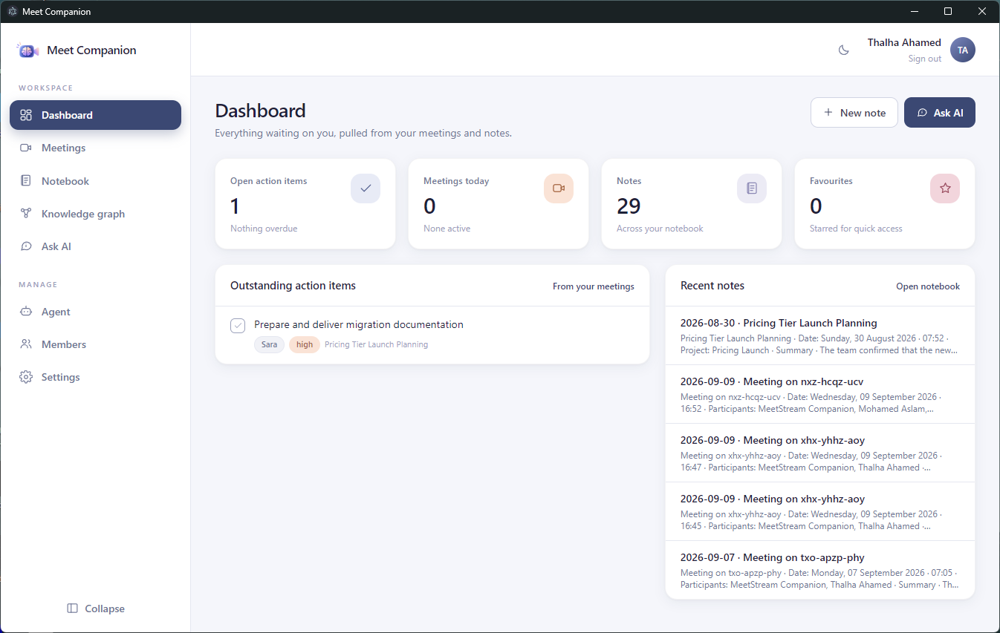

# Installation

## Desktop app

Download from the [latest release](https://github.com/ThalhaAhamed/MeetCompanion/releases/latest).

### 🪟 Windows

1. Download **`MeetCompanion-Windows-Setup.exe`**.
2. Run it. SmartScreen will show *Windows protected your PC* because the build
   is not code-signed yet — click **More info → Run anyway**.
3. Meet Companion opens on the first-run setup.

### 🍎 macOS

1. Download **`MeetCompanion-macOS-arm64.dmg`** (Apple silicon) or
   **`MeetCompanion-macOS-x64.dmg`** (Intel).
2. Drag **Meet Companion** into Applications.
3. First launch: **right-click → Open** to get past Gatekeeper (unsigned build).

### 🐧 Linux

```bash
chmod +x MeetCompanion-Linux-x86_64.AppImage
./MeetCompanion-Linux-x86_64.AppImage
```

### What happens on first launch

Setup is five short steps:

1. **Workspace** — start your own (you become its owner) or **join your
   team's** with the join code from their Members page.
2. **Account** — name, email, password, and optionally your **MeetStream API
   key** so the app can send a bot into calls (skip it if you only upload
   transcripts; add it later in Settings → Meetings).
3. **Storage** — local SQLite by default; a hosted Postgres to share the
   workspace with others. Joining a team means pasting the team's connection
   string here.
4. **AI model** — Ollama locally, or any supported provider with your key.
5. **Review** — one click, and you are in.

<div align="center">

</div>

You land on the dashboard:

<div align="center">

</div>

The embedding model (~90 MB) is downloaded once on first use. All data lives
under your user data directory:

| OS | Location |
| --- | --- |
| Windows | `%APPDATA%\Meet Companion\workspace\data` |
| macOS | `~/Library/Application Support/Meet Companion/workspace/data` |
| Linux | `~/.config/Meet Companion/workspace/data` |

Inside: `meet-companion.db` (your meetings, notes and memory — only when using
SQLite), `config.json` (settings, including keys), `device.key` and
`session.key` (sign-in secrets), and `models/` (the cached embedding model).
The folders next to `workspace` (`Cache`, `GPUCache`, `Local Storage`, …) are
Electron's browser cache and hold nothing of yours. To start over with the
wizard, quit the app and **rename** `workspace` rather than deleting it; your
data is only in that folder. `MEET_COMPANION_DATA_DIR` overrides the location.

> **Self-hosting instead?** `docker compose up -d` gives you the whole
> application on <http://localhost:8000> — see [Docker](configuration.md#docker). Or run it
> from source: [For developers](development.md).
